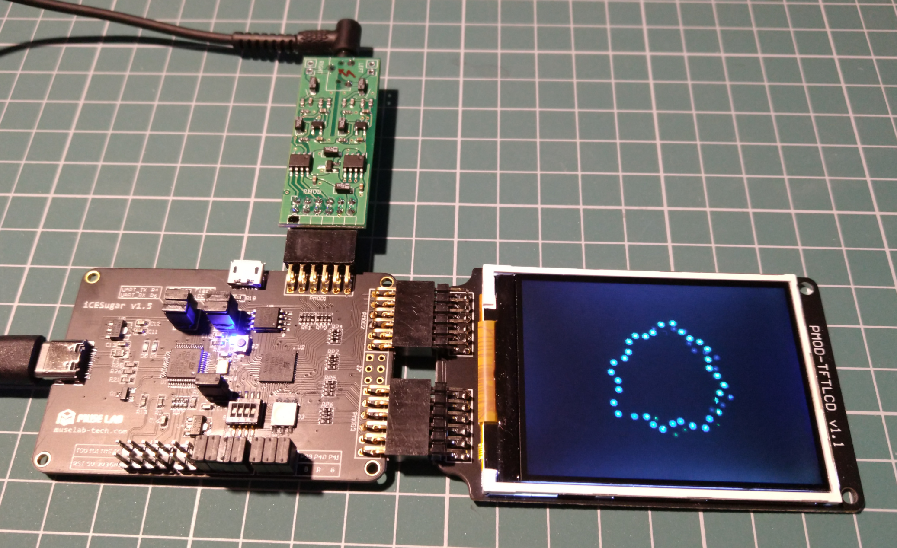

Light-organ based on [iCESugar 1.5](https://github.com/wuxx/icesugar)
board (Lattice iCE40UP5k), nameless SPI TFT LCD display from AliExpress,
and sound capture board [Dual MCP3102](https://github.com/punzik/dual-mcp3201-pmod).

Project is synthesized by [Yosys](https://github.com/YosysHQ/yosys), routed and
placed by [nextpnr](https://github.com/YosysHQ/nextpnr), verefied by
[iverilog](https://github.com/steveicarus/iverilog) and
[verilator](https://github.com/verilator/verilator). For scripting, prototyping and
GUI use [Racket](https://racket-lang.org/) and [GNU
Octave](https://www.gnu.org/software/octave/index).

Video 1: https://youtu.be/959pEzaWLlk

Video 2: https://youtu.be/qtpC32GN3NM

